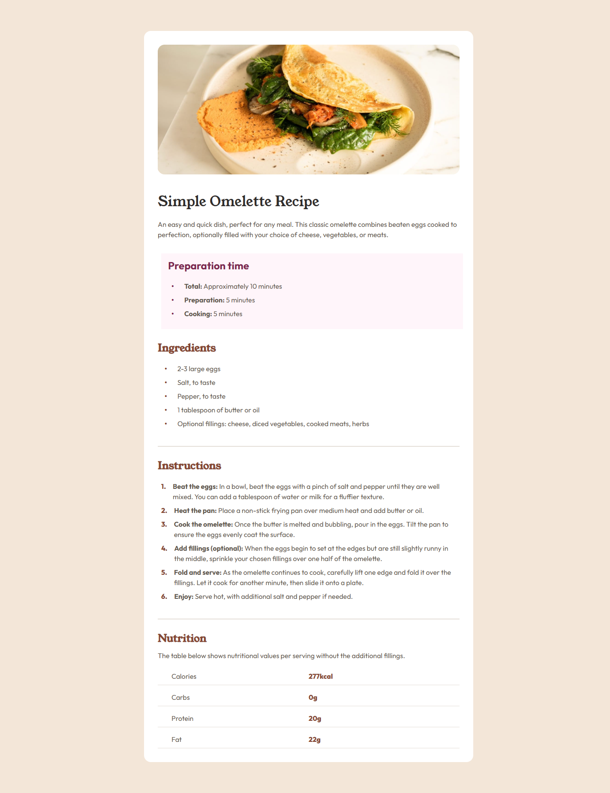

# Frontend Mentor - Recipe page solution

This is a solution to the [Recipe page challenge on Frontend Mentor](https://www.frontendmentor.io/challenges/recipe-page-KiTsR8QQKm). Frontend Mentor challenges help you improve your coding skills by building realistic projects.

## Table of contents

- [Overview](#overview)
  - [Screenshot](#screenshot)
  - [Links](#links)
- [My process](#my-process)
  - [Built with](#built-with)
  - [What I learned](#what-i-learned)
  - [Continued development](#continued-development)
  - [Useful resources](#useful-resources)
- [Author](#author)

## Overview

### Screenshot



### Links

- Solution URL: [Solution URL here]
- Live Site URL: [Live site URL here]

## My process

### Built with

- Semantic HTML5 markup
- CSS custom properties
- Flexbox
- Mobile-first workflow
- Custom CSS Reset
- Google Fonts
- BEM Methodology

### What I learned

During this project, I improved my skills in:

1. **Using CSS Variables for Theme Management:**

```css
:root {
  --white: hsl(0, 0%, 100%);
  --stone-100: hsl(30, 54%, 90%);
  --stone-150: hsl(30, 18%, 87%);
  --stone-600: hsl(30, 10%, 34%);
  --stone-900: hsl(24, 5%, 18%);
  --brown-800: hsl(14, 45%, 36%);
  --rose-800: hsl(332, 51%, 32%);
  --rose-50: hsl(330, 100%, 98%);
}
```

2. **Implementing Custom Typography:**

```css
:root {
  --font-serif: "Young Serif", serif;
  --font-sans: "Outfit", system-ui, -apple-system, sans-serif;
}
```

3. **Creating Responsive Layouts:**

```css
@media (min-width: 1440px) {
  .container {
    max-width: 768px;
  }

  .recipe {
    border-radius: 16px;
    margin: 72px auto;
  }
}
```

4. **Structuring Complex Content:**

```html
<article class="recipe container">
  <header class="recipe__header">
    <h1 class="recipe__title">Simple Omelette Recipe</h1>
  </header>
</article>
```

### Continued development

Areas I want to focus on in future projects:

1. Advanced CSS Grid implementations
2. Animation and transition effects
3. Accessibility improvements
4. Performance optimization
5. Cross-browser compatibility

### Useful resources

- [MDN Web Docs](https://developer.mozilla.org/en-US/docs/Web/CSS) - Comprehensive CSS reference
- [CSS-Tricks](https://css-tricks.com/) - Modern CSS techniques
- [BEM Methodology](https://getbem.com/) - CSS naming conventions

## Author

- Frontend Mentor - [@Saran-Sandeep](https://www.frontendmentor.io/profile/Saran-Sandeep)
- GitHub - [@Saran-Sandeep](https://github.com/Saran-Sandeep)

This README follows the structure of your previous successful implementations while incorporating the specific details of the Recipe Page project.

Citations:
[1] https://www.frontendmentor.io/challenges/recipe-page-KiTsR8QQKm
